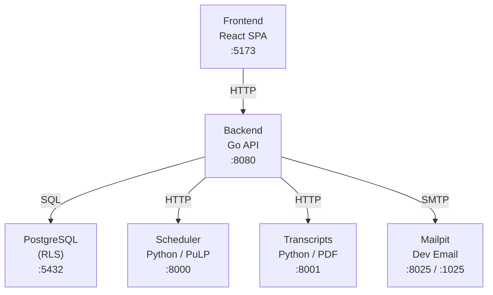
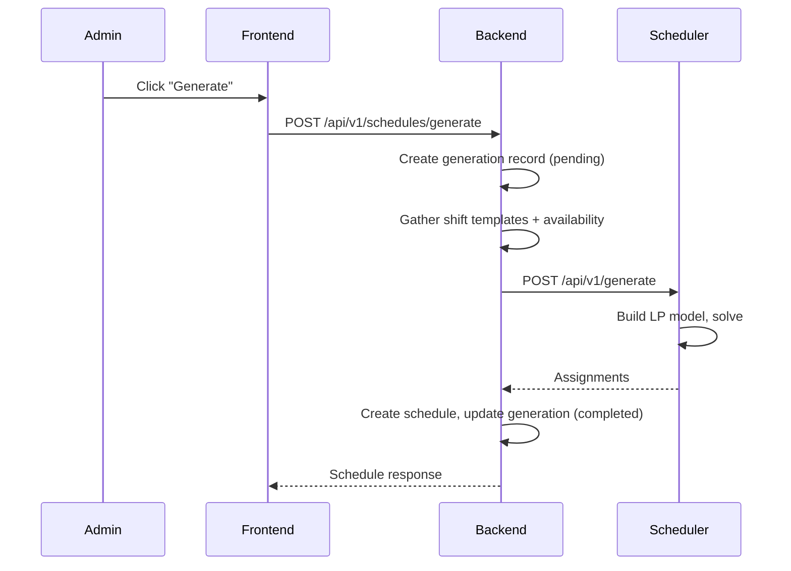
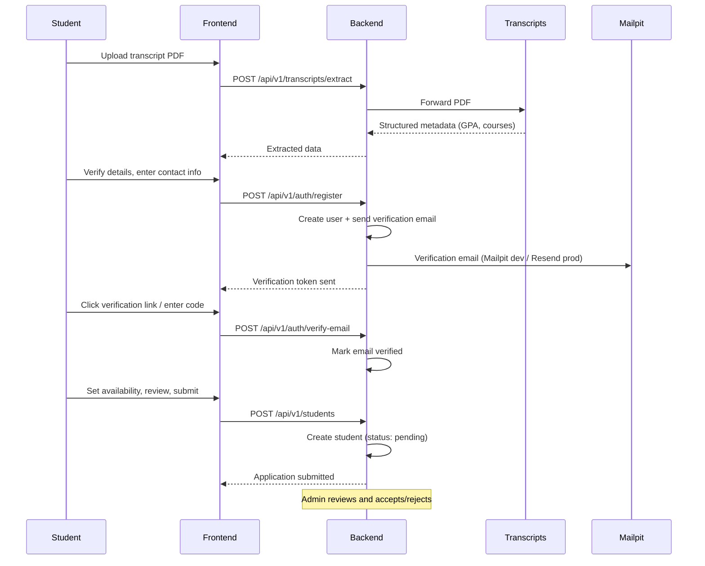

# Development Guide

High-level architecture and development workflow for the HelpDesk Rostering monorepo. For app-specific implementation guides, see:

- [Backend Development Guide](apps/backend/DEVELOPMENT.md)
- [Frontend Development Guide](apps/frontend/DEVELOPMENT.md)

## Table of Contents

- [System Architecture](#system-architecture)
- [Services](#services)
  - [Frontend](#frontend)
  - [Backend](#backend)
  - [Scheduler](#scheduler)
  - [Transcript Extraction](#transcript-extraction)
  - [PostgreSQL](#postgresql)
  - [Mailpit](#mailpit)
- [Project Structure](#project-structure)
- [Data Flow](#data-flow)
  - [Schedule Generation](#schedule-generation)
  - [Student Application](#student-application)
- [Database Architecture](#database-architecture)
  - [Schemas](#schemas)
  - [Row-Level Security](#row-level-security)
  - [Migrations](#migrations)
- [Development Workflow](#development-workflow)
  - [First-Time Setup](#first-time-setup)
  - [Daily Development](#daily-development)
  - [Database Reset](#database-reset)
- [Environment Variables](#environment-variables)

---

## System Architecture



All services run via Docker Compose (`docker-compose.local.yml`). The backend is the central service — it owns the database and orchestrates calls to the scheduler and transcript extraction services.

---

## Services

### Frontend

| | |
|---|---|
| **Location** | `apps/frontend/` |
| **Tech** | React 19, TypeScript, TanStack Router, Tailwind CSS 4, shadcn/ui |
| **Port** | `5173` |
| **Dev Guide** | [apps/frontend/DEVELOPMENT.md](apps/frontend/DEVELOPMENT.md) |

Single-page application with file-based routing. Dual-role UI (admin and student views) controlled via `useUser()` context. Currently uses mock data — ready for backend API integration.

### Backend

| | |
|---|---|
| **Location** | `apps/backend/` |
| **Tech** | Go 1.24, Chi router, Go-Jet v2 ORM, zap logger |
| **Port** | `8080` |
| **Dev Guide** | [apps/backend/DEVELOPMENT.md](apps/backend/DEVELOPMENT.md) |

REST API using Domain-Driven Design. Domains: `schedule`, `user`. Each domain follows the pattern: aggregate → errors → repository interface → infrastructure repo → service → handler → DTOs.

Key architectural decisions:
- **Transaction manager** with two modes: `InAuthTx` (RLS-enforced reads) and `InSystemTx` (bypasses RLS for writes)
- **Go-Jet** for type-safe SQL (models generated from live database)
- **Hot reload** via Air in Docker

### Scheduler

| | |
|---|---|
| **Location** | `apps/scheduler/` |
| **Tech** | Python, FastAPI, PuLP (LP solver) |
| **Port** | `8000` (internal only) |

Linear programming optimizer that generates shift assignments. Takes assistants (with availability and course knowledge), shift templates (with staffing requirements), and a config (penalty weights) as input. Returns optimal assignments minimizing understaffing, course shortfalls, and hour imbalances.

**API:** `POST /api/v1/generate` — accepts a schedule generation request, returns assignments.

### Transcript Extraction

| | |
|---|---|
| **Location** | `apps/transcripts/` |
| **Tech** | Python, FastAPI, PDF parsing |
| **Port** | `8001` (internal only) |

Extracts structured academic data (GPA, courses, degree programme) from uploaded PDF transcripts. Called by the backend during student application processing.

**API:** `POST /api/v1/extract` — accepts a PDF file, returns structured transcript metadata.

### PostgreSQL

| | |
|---|---|
| **Image** | `postgres:16-alpine` |
| **Port** | `5432` |
| **Credentials** | `helpdesk` / `helpdesk_local` / `helpdesk` |

Two schemas (`auth`, `schedule`) with Row-Level Security. See [Database Architecture](#database-architecture) for details.

### Mailpit

| | |
|---|---|
| **Image** | `axllent/mailpit` |
| **Web UI** | `8025` |
| **SMTP** | `1025` |

Local email capture for development. All emails sent by the backend (verification, notifications) are caught here instead of delivered.

---

## Project Structure

```
├── apps/
│   ├── backend/                # Go REST API (DDD)
│   │   ├── cmd/server/         # Entry point
│   │   ├── internal/
│   │   │   ├── application/    # App config, routes, wiring
│   │   │   ├── domain/         # Business logic (schedule, user)
│   │   │   ├── infrastructure/ # Database, external services, models
│   │   │   ├── middleware/     # JWT auth
│   │   │   └── tests/          # Unit, integration, e2e, mocks
│   │   └── DEVELOPMENT.md
│   ├── frontend/               # React SPA
│   │   ├── src/
│   │   │   ├── routes/         # File-based routing (TanStack Router)
│   │   │   ├── features/       # Feature modules (sign-up, admin, student)
│   │   │   ├── components/     # Shared + shadcn/ui components
│   │   │   ├── hooks/          # Custom React hooks
│   │   │   ├── types/          # TypeScript interfaces
│   │   │   └── lib/            # Utilities, constants, mock data
│   │   └── DEVELOPMENT.md
│   ├── scheduler/              # Python FastAPI — LP optimizer (PuLP)
│   │   ├── app/
│   │   │   ├── main.py         # FastAPI app
│   │   │   ├── linear_scheduler.py  # PuLP solver
│   │   │   └── models/         # Request/response DTOs
│   │   └── tests/
│   └── transcripts/            # Python FastAPI — PDF transcript parser
│       ├── app/
│       ├── main.py
│       └── tests/
├── migrations/                 # SQL migrations (golang-migrate)
│   ├── 000001_initial_schema.{up,down}.sql
│   ├── 000002_rls_grants_and_policies.{up,down}.sql
│   ├── 000003_add_scheduler_tables.{up,down}.sql
│   ├── 000004_refresh_tokens.{up,down}.sql
│   ├── 000005_email_verification.{up,down}.sql
│   └── 000006_auth_tokens.{up,down}.sql
├── scripts/
│   ├── seed_dev.sh             # Seed database with dev data
│   └── visualize.sh            # CLI schedule/shift visualization
├── docker-compose.local.yml    # Local dev services
└── Taskfile.yml                # Task runner definitions
```

---

## Data Flow

### Schedule Generation



### Student Application



---

## Database Architecture

### Schemas

| Schema | Purpose | Tables |
|--------|---------|--------|
| `auth` | Users, students, authentication | `users`, `students`, `banking_details`, `payments`, `refresh_tokens`, `auth_tokens` |
| `schedule` | Scheduling and time tracking | `schedules`, `schedule_generations`, `shift_templates`, `scheduler_configs`, `time_logs` |

See [apps/backend/DEVELOPMENT.md](apps/backend/DEVELOPMENT.md) for implementation patterns (aggregates, repositories, Go-Jet queries).

### Row-Level Security

PostgreSQL RLS enforces data access at the database level. Two roles:

| Role | Purpose | Usage |
|------|---------|-------|
| `authenticated` | User requests with RLS enforcement | `InAuthTx` — session vars set: `app.current_user_id`, `app.current_role`, `app.current_student_id` |
| `internal` | System operations, full access | `InSystemTx` — bypasses all RLS policies |

**Policy patterns:**
- Admins see all rows, students see only their own
- Write operations go through `internal` role (via `InSystemTx`)
- Token tables (`refresh_tokens`, `auth_tokens`) are internal-only

### Migrations

Managed by [golang-migrate](https://github.com/golang-migrate/migrate). Each migration has an `up.sql` and `down.sql`.

```bash
task migrate:create -- add_feature_name  # Create new migration
task migrate:up                          # Apply all pending
task migrate:down                        # Rollback last one
task migrate:reset                       # Rollback all
task generate:models                     # Regenerate Go-Jet models
```

Migration files include: table DDL, indexes, triggers (`set_updated_at`, `set_created_by`), RLS policies, and grants.

---

## Development Workflow

### First-Time Setup

```bash
# 1. Install global tools

# Task runner (pick one)
brew install go-task/tap/go-task                  # macOS (Homebrew)
sudo snap install task --classic                  # Linux (Snap)
winget install Task.Task                          # Windows (WinGet)
npm install -g @go-task/cli                       # Any OS (npm)

# Go tools
go install -tags 'postgres' github.com/golang-migrate/migrate/v4/cmd/migrate@latest
go install github.com/go-jet/jet/v2/cmd/jet@latest

# 2. Start all services (database, backend, frontend, scheduler, transcripts, mailpit)
task start

# 3. Run migrations and generate models
task migrate:up
task generate:models

# 4. Seed dev data
task db:seed
```

### Daily Development

```bash
task start                # Start all services (Docker Compose)
task stop                 # Stop all services
task logs                 # Tail service logs

# Testing
task test                 # Run all tests (backend + scheduler + transcripts + frontend)
task test:backend         # Backend only (Go)
task test:scheduler       # Scheduler only (pytest)
task test:transcript      # Transcript extraction only (pytest)
task test:frontend        # Frontend only (pnpm)

# Database
task db:studio            # Open Drizzle Studio (database viewer)
task db:reset             # Drop, recreate, migrate, seed

# Visualization (CLI)
task visualize:shifts                    # Show shift template grid
task visualize:schedule -- <id>          # Show schedule assignments
task visualize:availability -- <id>      # Show assistant availability
```

### Database Reset

Full reset: drops volumes, recreates database, runs migrations, restarts services, seeds data.

```bash
task db:reset
```

---

## Environment Variables

Create `.env.local` at the project root (used by Docker Compose):

| Variable | Default | Description |
|----------|---------|-------------|
| `PORT` | `8080` | Backend server port |
| `DATABASE_URL` | (set in compose) | PostgreSQL connection string |
| `ENVIRONMENT` | `development` | `development` or `production` |
| `DEV_USER_ID` | | UUID — enables dev auth middleware (bypasses JWT) |
| `JWT_SECRET` | (required) | Signing key for JWTs (min 32 chars) |
| `ACCESS_TOKEN_TTL` | `900` | Access token lifetime in seconds (15 min) |
| `REFRESH_TOKEN_TTL` | `604800` | Refresh token lifetime in seconds (7 days) |
| `VERIFICATION_TOKEN_TTL` | `86400` | Email verification token lifetime (24 hrs) |
| `FRONTEND_URL` | `http://localhost:5173` | Frontend URL (used in email links) |
| `FROM_EMAIL` | `noreply@uwi.edu` | Sender address for outbound emails |
| `TRANSCRIPTS_SERVICE_URL` | `http://transcripts:8001` | Transcript extraction service URL |
