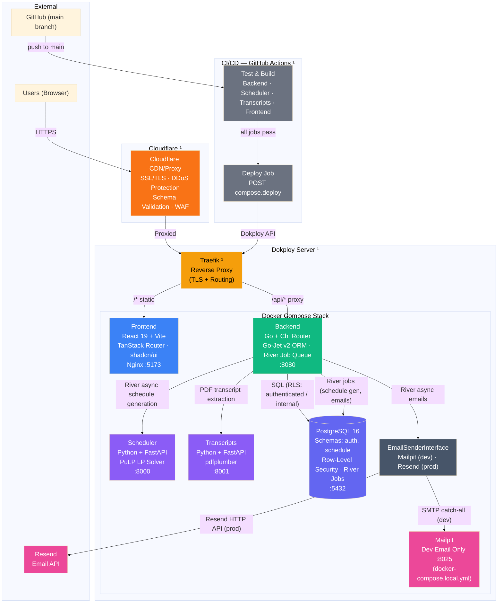
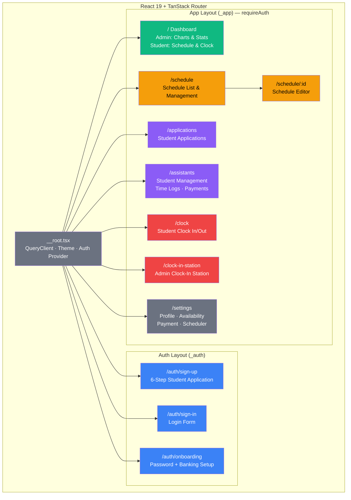

# System Architecture

## Backend Domain Architecture

```mermaid
graph LR
    subgraph "Go Backend (DDD)"
        direction TB

        subgraph "Domain Layer"
            AUTH["Auth Domain<br/>Register · Login · Logout<br/>Email Verification<br/>Password Reset<br/>Onboarding · JWT Tokens"]
            STU["Student Domain<br/>Apply · Accept · Reject<br/>Profile · Banking Details<br/>Availability · Transcripts"]
            SCHED["Schedule Domain<br/>CRUD · Lifecycle<br/>Draft → Active → Archived<br/>Notify Students"]
            GEN["Schedule Generation<br/>Create Generation<br/>Status Tracking<br/>Pending → Completed/Failed"]
            SHIFT["Shift Template Domain<br/>CRUD · Bulk Create<br/>Activate · Deactivate"]
            CONFIG["Scheduler Config Domain<br/>CRUD · Delete · Set Default<br/>Constraint Parameters"]
            USER["User Domain<br/>CRUD · Role Management<br/>Profile Updates (name/email)"]
            TIMELOG["Time Log Domain<br/>Clock In/Out · GPS Validation<br/>Flag/Unflag · Admin List"]
            PAYROLL["Payroll Domain<br/>Generate · Process · Revert<br/>Bulk Process · CSV Export"]
            VERIFY["Verification Domain<br/>Send Code · Verify Code<br/>Email Verification"]
            TRANS["Transcript Domain<br/>PDF Upload · Extract<br/>Student Metadata"]
            CONSENT["Consent Domain<br/>Banking Consent Tracking"]
        end

        subgraph "Infrastructure Layer"
            REPO["Repository Implementations<br/>(Go-Jet v2)"]
            TX["Transaction Manager<br/>InAuthTx (RLS) · InSystemTx"]
            EMAIL["Email Sender<br/>Mailpit (dev) · Resend (prod)"]
            CRYPTO["Crypto Utils<br/>Banking Details Encryption"]
            RIVER["River Job Queue<br/>Schedule Generation<br/>Email Notifications"]
        end
    end

    AUTH --> REPO
    STU --> REPO
    SCHED --> REPO
    GEN --> REPO
    SHIFT --> REPO
    CONFIG --> REPO
    USER --> REPO
    TIMELOG --> REPO
    PAYROLL --> REPO
    VERIFY --> REPO
    CONSENT --> REPO
    REPO --> TX

    AUTH --> EMAIL
    STU --> EMAIL
    VERIFY --> EMAIL
    STU --> CRYPTO
    GEN --> RIVER

    style AUTH fill:#10b981,color:#fff
    style STU fill:#3b82f6,color:#fff
    style SCHED fill:#f59e0b,color:#000
    style GEN fill:#f59e0b,color:#000
    style SHIFT fill:#f59e0b,color:#000
    style CONFIG fill:#f59e0b,color:#000
    style USER fill:#8b5cf6,color:#fff
    style TIMELOG fill:#ef4444,color:#fff
    style PAYROLL fill:#f97316,color:#fff
    style VERIFY fill:#ec4899,color:#fff
    style TRANS fill:#ec4899,color:#fff
    style CONSENT fill:#6b7280,color:#fff
    style REPO fill:#6366f1,color:#fff
    style TX fill:#6366f1,color:#fff
    style EMAIL fill:#6366f1,color:#fff
    style CRYPTO fill:#6366f1,color:#fff
    style RIVER fill:#6366f1,color:#fff
```

## Frontend Architecture

## Services

| Service | Tech Stack | Port | Purpose |
|---------|-----------|------|---------|
| **Frontend** | React 19, Vite, TanStack Router, shadcn/ui, Tailwind CSS 4 | 5173 | SPA served via Nginx |
| **Backend** | Go 1.25, Chi router, Go-Jet v2, River job queue, Zap logging | 8080 | REST API, business logic, auth, async jobs |
| **Scheduler** | Python, FastAPI, PuLP | 8000 | LP-based schedule optimization |
| **Transcripts** | Python, FastAPI, pdfplumber | 8001 | PDF transcript extraction |
| **PostgreSQL** | PostgreSQL 16, RLS | 5432 | Data storage with Row-Level Security |
| **Email** | Mailpit (dev) / Resend (prod) | — | Transactional emails |

## API Endpoints

### Public Routes

| Method | Path | Purpose |
|--------|------|---------|
| POST | `/api/v1/auth/register` | User registration |
| POST | `/api/v1/auth/login` | User login |
| POST | `/api/v1/auth/refresh` | Refresh access token |
| POST | `/api/v1/auth/logout` | Logout |
| POST | `/api/v1/auth/verify-email` | Email verification |
| POST | `/api/v1/auth/resend-verification` | Resend verification email |
| POST | `/api/v1/auth/forgot-password` | Request password reset |
| POST | `/api/v1/auth/reset-password` | Reset password |
| POST | `/api/v1/auth/validate-onboarding-token` | Validate onboarding token |
| POST | `/api/v1/auth/complete-onboarding` | Complete onboarding |
| POST | `/api/v1/transcripts/extract` | Extract transcript from PDF |
| POST | `/api/v1/students` | Student application |
| POST | `/api/v1/verification/send-code` | Send verification code |
| POST | `/api/v1/verification/verify-code` | Verify code |

### Authenticated Routes

| Method | Path | Purpose |
|--------|------|---------|
| PATCH | `/api/v1/auth/change-password` | Change password |
| GET | `/api/v1/schedules/active` | Get active schedule |
| GET | `/api/v1/schedules/{id}` | Get schedule by ID |
| GET | `/api/v1/shift-templates` | List active shift templates |
| GET | `/api/v1/users/{id}` | Get user by ID |
| PUT | `/api/v1/users/{id}` | Update a user |
| PUT | `/api/v1/users/me` | Update own profile (name, email) |
| GET | `/api/v1/students/me` | Get own student profile |
| PUT | `/api/v1/students/me` | Update own profile (phone, availability, transcript data) |
| GET | `/api/v1/students/me/banking-details` | Get own banking details |
| PUT | `/api/v1/students/me/banking-details` | Upsert own banking details (partial) |
| POST | `/api/v1/transcripts/extract` | Extract transcript from PDF |
| POST | `/api/v1/time-logs/clock-in` | Clock in with code + GPS |
| POST | `/api/v1/time-logs/clock-out` | Clock out |
| GET | `/api/v1/time-logs/me/status` | Get clock-in status |
| GET | `/api/v1/time-logs/me` | List own time logs |
| GET | `/api/v1/consent/current` | Get current consent version |

### Admin Routes

| Method | Path | Purpose |
|--------|------|---------|
| POST | `/api/v1/schedules` | Create schedule |
| POST | `/api/v1/schedules/generate` | Generate schedule (async — 202) |
| GET | `/api/v1/schedules` | List schedules |
| GET | `/api/v1/schedules/archived` | List archived schedules |
| PUT | `/api/v1/schedules/{id}` | Update schedule |
| PATCH | `/api/v1/schedules/{id}/archive` | Archive schedule |
| PATCH | `/api/v1/schedules/{id}/unarchive` | Unarchive schedule |
| PATCH | `/api/v1/schedules/{id}/activate` | Activate schedule |
| PATCH | `/api/v1/schedules/{id}/deactivate` | Deactivate schedule |
| POST | `/api/v1/schedules/{id}/notify` | Notify students (async) |
| GET | `/api/v1/schedule-generations/` | List generations |
| GET | `/api/v1/schedule-generations/{id}` | Get generation details |
| GET | `/api/v1/schedule-generations/{id}/status` | Get generation status |
| POST | `/api/v1/shift-templates/` | Create shift template |
| POST | `/api/v1/shift-templates/bulk` | Bulk create templates |
| GET | `/api/v1/shift-templates/all` | List all templates |
| PUT | `/api/v1/shift-templates/{id}` | Update shift template |
| PATCH | `/api/v1/shift-templates/{id}/activate` | Activate template |
| PATCH | `/api/v1/shift-templates/{id}/deactivate` | Deactivate template |
| POST | `/api/v1/scheduler-configs/` | Create scheduler config |
| GET | `/api/v1/scheduler-configs/` | List configs |
| GET | `/api/v1/scheduler-configs/default` | Get default config |
| GET | `/api/v1/scheduler-configs/{id}` | Get config details |
| PUT | `/api/v1/scheduler-configs/{id}` | Update config |
| DELETE | `/api/v1/scheduler-configs/{id}` | Delete config (not default) |
| PATCH | `/api/v1/scheduler-configs/{id}/set-default` | Set default config |
| GET | `/api/v1/students` | List students |
| GET | `/api/v1/students/{id}` | Get student by ID |
| PATCH | `/api/v1/students/{id}/accept` | Accept student |
| PATCH | `/api/v1/students/{id}/reject` | Reject student |
| PATCH | `/api/v1/students/{id}/deactivate` | Deactivate student |
| PATCH | `/api/v1/students/{id}/activate` | Activate student |
| PATCH | `/api/v1/students/bulk-deactivate` | Bulk deactivate students |
| PATCH | `/api/v1/students/bulk-activate` | Bulk activate students |
| GET | `/api/v1/students/{id}/banking-details` | Get student banking details |
| PUT | `/api/v1/students/{id}/banking-details` | Upsert student banking details |
| POST | `/api/v1/users` | Create user |
| GET | `/api/v1/users` | List users |
| DELETE | `/api/v1/users/{id}` | Deactivate user |
| GET | `/api/v1/time-logs` | List all time logs |
| GET | `/api/v1/time-logs/{id}` | Get time log by ID |
| PATCH | `/api/v1/time-logs/{id}/flag` | Flag time log |
| PATCH | `/api/v1/time-logs/{id}/unflag` | Unflag time log |
| POST | `/api/v1/clock-in-codes/` | Generate clock-in code |
| GET | `/api/v1/clock-in-codes/active` | Get active code |
| GET | `/api/v1/payroll/` | List payments |
| POST | `/api/v1/payroll/generate` | Generate payments |
| POST | `/api/v1/payroll/{id}/process` | Process payment |
| POST | `/api/v1/payroll/{id}/revert` | Revert payment |
| POST | `/api/v1/payroll/bulk-process` | Bulk process payments |
| GET | `/api/v1/payroll/export` | Export payments CSV |

## Request Flow

1. **Users** hit **Cloudflare** (DNS, SSL/TLS, DDoS protection, schema validation)
2. Cloudflare proxies to **Traefik** on the Dokploy server
3. Traefik routes static assets to **Frontend** and `/api/*` requests to **Backend**
4. **Backend** calls **Scheduler** (schedule generation) and **Transcripts** (PDF parsing) over internal Docker network
5. **Backend** queries **PostgreSQL** using role-based transactions (`authenticated` for reads with RLS, `internal` for writes)
6. **Backend** sends transactional emails via **Mailpit** (dev) or **Resend** (prod)

## CI/CD Flow

1. Push to `main` triggers GitHub Actions
2. All 4 test/build jobs run in parallel (backend, scheduler, transcripts, frontend)
3. On success, the deploy job calls the Dokploy API to rebuild the compose stack
