# Use Case Diagram

```mermaid
graph TB
    subgraph Actors
        STUDENT(["Student<br/>(Applicant)"])
        ADMIN(["Admin<br/>(Staff)"])
        SYSTEM(["System<br/>(Automated)"])
    end

    subgraph "Student Registration"
        UC1["Upload Transcript PDF"]
        UC2["Verify Extracted Details"]
        UC3["Enter Contact Info"]
        UC4["Verify Email Address"]
        UC5["Set Availability"]
        UC6["Submit Application"]
    end

    subgraph "Student Onboarding"
        UC7["Receive Onboarding Email"]
        UC8["Set Password"]
        UC9["Enter Banking Details"]
        UC10["Auto Sign-In"]
    end

    subgraph "Admin Student Management"
        UC11["View Pending Applications"]
        UC12["Review Application Details"]
        UC13["Accept Student"]
        UC14["Reject Student"]
        UC15["Undo Accept/Reject"]
    end

    subgraph "Admin Schedule Generation"
        UC16["Manage Shift Templates"]
        UC17["Configure Scheduler"]
        UC18["Create Schedule"]
        UC19["Generate Schedule"]
        UC20["Monitor Generation Status"]
        UC21["Activate Schedule"]
        UC22["Notify Students"]
        UC23["Archive Schedule"]
    end

    subgraph "Clock-In / Clock-Out"
        UC33["Generate Clock-In Code"]
        UC34["Clock In (Code + GPS)"]
        UC35["Clock Out"]
        UC36["View Clock Status"]
    end

    subgraph "Time Log Management"
        UC37["View All Time Logs"]
        UC38["Flag Time Log"]
        UC39["Unflag Time Log"]
    end

    subgraph "Payroll"
        UC40["Generate Payments"]
        UC41["Process Payment"]
        UC42["Bulk Process Payments"]
        UC43["Export Payments CSV"]
    end

    subgraph "Student Self-Service"
        UC24["View Dashboard"]
        UC25["View My Profile"]
        UC26["Update Availability"]
        UC27["View Active Schedule"]
        UC44["Update Banking Details"]
        UC45["Upload Transcript"]
        UC46["View Time Logs"]
    end

    subgraph "Admin Settings"
        UC47["Update Profile (Name/Email)"]
        UC48["Manage Scheduler Configs"]
        UC49["Delete Scheduler Config"]
    end

    subgraph "Authentication"
        UC28["Register Account"]
        UC29["Sign In"]
        UC30["Sign Out"]
        UC31["Reset Password"]
        UC32["Change Password"]
    end

    %% Student Registration
    STUDENT --> UC1
    UC1 --> UC2
    UC2 --> UC3
    UC3 --> UC4
    UC4 --> UC5
    UC5 --> UC6

    %% Student Onboarding
    STUDENT --> UC7
    UC7 --> UC8
    UC8 --> UC9
    UC9 --> UC10

    %% Admin Student Management
    ADMIN --> UC11
    UC11 --> UC12
    UC12 --> UC13
    UC12 --> UC14
    ADMIN --> UC15

    %% System automated actions
    SYSTEM --> UC7
    SYSTEM --> UC19

    %% Admin accepts triggers onboarding email
    UC13 -.->|"triggers"| UC7

    %% Admin Schedule Generation
    ADMIN --> UC16
    ADMIN --> UC17
    ADMIN --> UC18
    UC18 --> UC19
    UC19 --> UC20
    UC20 --> UC21
    UC21 --> UC22
    ADMIN --> UC23

    %% Clock-In / Clock-Out
    ADMIN --> UC33
    STUDENT --> UC34
    STUDENT --> UC35
    STUDENT --> UC36

    %% Time Log Management
    ADMIN --> UC37
    ADMIN --> UC38
    ADMIN --> UC39

    %% Payroll
    ADMIN --> UC40
    ADMIN --> UC41
    ADMIN --> UC42
    ADMIN --> UC43

    %% Student Self-Service
    STUDENT --> UC24
    STUDENT --> UC25
    STUDENT --> UC26
    STUDENT --> UC27
    STUDENT --> UC44
    STUDENT --> UC45
    STUDENT --> UC46

    %% Admin Settings
    ADMIN --> UC47
    ADMIN --> UC48
    ADMIN --> UC49

    %% Authentication
    STUDENT --> UC28
    STUDENT --> UC29
    ADMIN --> UC29
    STUDENT --> UC30
    ADMIN --> UC30
    STUDENT --> UC31
    ADMIN --> UC31
    STUDENT --> UC32
    ADMIN --> UC32

    style STUDENT fill:#3b82f6,color:#fff
    style ADMIN fill:#10b981,color:#fff
    style SYSTEM fill:#6b7280,color:#fff
```

## Use Case Summary

### Student Registration (Public)
| # | Use Case | Actor | Description |
|---|----------|-------|-------------|
| UC1 | Upload Transcript PDF | Student | Upload UWI transcript for metadata extraction |
| UC2 | Verify Extracted Details | Student | Confirm student ID, name, GPA, courses from PDF |
| UC3 | Enter Contact Info | Student | Provide email (@my.uwi.edu) and phone number |
| UC4 | Verify Email Address | Student | Enter OTP code sent to email |
| UC5 | Set Availability | Student | Select available hours for Mon-Fri |
| UC6 | Submit Application | Student | Final review and submit; status becomes **pending** |

### Student Onboarding (Post-Acceptance)
| # | Use Case | Actor | Description |
|---|----------|-------|-------------|
| UC7 | Receive Onboarding Email | System | Automated email with onboarding link sent on acceptance |
| UC8 | Set Password | Student | Create secure password (8+ chars, complexity rules) |
| UC9 | Enter Banking Details | Student | Bank name, branch, account type, account number |
| UC10 | Auto Sign-In | System | JWT tokens issued, redirect to student dashboard |

### Admin Student Management
| # | Use Case | Actor | Description |
|---|----------|-------|-------------|
| UC11 | View Pending Applications | Admin | List students filtered by status (pending/accepted/rejected) |
| UC12 | Review Application Details | Admin | View student ID, name, GPA, transcript, availability |
| UC13 | Accept Student | Admin | Accept application, triggers user creation + onboarding email |
| UC14 | Reject Student | Admin | Reject application, sends rejection email |
| UC15 | Undo Accept/Reject | Admin | Reverse previous decision (invalidates tokens if undoing accept) |

### Admin Schedule Generation
| # | Use Case | Actor | Description |
|---|----------|-------|-------------|
| UC16 | Manage Shift Templates | Admin | Create, update, activate, deactivate shift templates |
| UC17 | Configure Scheduler | Admin | Create/update scheduler configs with constraint parameters |
| UC18 | Create Schedule | Admin | Create new schedule (draft status) |
| UC19 | Generate Schedule | Admin/System | Run LP solver to optimize student shift assignments |
| UC20 | Monitor Generation Status | Admin | Poll generation status (pending → completed/failed/infeasible) |
| UC21 | Activate Schedule | Admin | Activate a draft/generated schedule |
| UC22 | Notify Students | Admin | Send schedule notification emails to assigned students |
| UC23 | Archive Schedule | Admin | Archive old schedules |

### Clock-In / Clock-Out
| # | Use Case | Actor | Description |
|---|----------|-------|-------------|
| UC33 | Generate Clock-In Code | Admin | Generate QR/code for the clock-in station |
| UC34 | Clock In | Student | Enter code + GPS location to start shift |
| UC35 | Clock Out | Student | End current shift (auto-records exit time) |
| UC36 | View Clock Status | Student | See current clock-in status and shift info |

### Time Log Management (Admin)
| # | Use Case | Actor | Description |
|---|----------|-------|-------------|
| UC37 | View All Time Logs | Admin | List all time logs (paginated, searchable) |
| UC38 | Flag Time Log | Admin | Flag a suspicious time log with reason |
| UC39 | Unflag Time Log | Admin | Remove flag from a time log |

### Payroll (Admin)
| # | Use Case | Actor | Description |
|---|----------|-------|-------------|
| UC40 | Generate Payments | Admin | Generate payment records for a pay period |
| UC41 | Process Payment | Admin | Mark a payment as processed |
| UC42 | Bulk Process Payments | Admin | Process multiple payments at once |
| UC43 | Export Payments CSV | Admin | Export payment data for payroll processing |

### Student Self-Service (Authenticated)
| # | Use Case | Actor | Description |
|---|----------|-------|-------------|
| UC24 | View Dashboard | Student | View current schedule, earnings, hours logged |
| UC25 | View My Profile | Student | View own student profile and details |
| UC26 | Update Availability | Student | Modify available hours and weekly hour preferences |
| UC27 | View Active Schedule | Student | View assigned shifts in active schedule |
| UC44 | Update Banking Details | Student | Edit bank name, branch, account type, or account number (partial updates) |
| UC45 | Upload Transcript | Student | Re-upload transcript to update courses, GPA, year, programme, major |
| UC46 | View Time Logs | Student | View own clock-in/out history |

### Admin Settings
| # | Use Case | Actor | Description |
|---|----------|-------|-------------|
| UC47 | Update Profile | Admin | Edit name and email (JWT refreshed after update) |
| UC48 | Manage Scheduler Configs | Admin | Create, edit, set default scheduler configurations |
| UC49 | Delete Scheduler Config | Admin | Delete a non-default config (default cannot be deleted) |

### Authentication
| # | Use Case | Actor | Description |
|---|----------|-------|-------------|
| UC28 | Register Account | Student | Admin accounts created manually; students register via application |
| UC29 | Sign In | Both | Email + password login |
| UC30 | Sign Out | Both | Invalidate tokens |
| UC31 | Reset Password | Both | Email-based password reset flow |
| UC32 | Change Password | Both | Authenticated password change |
