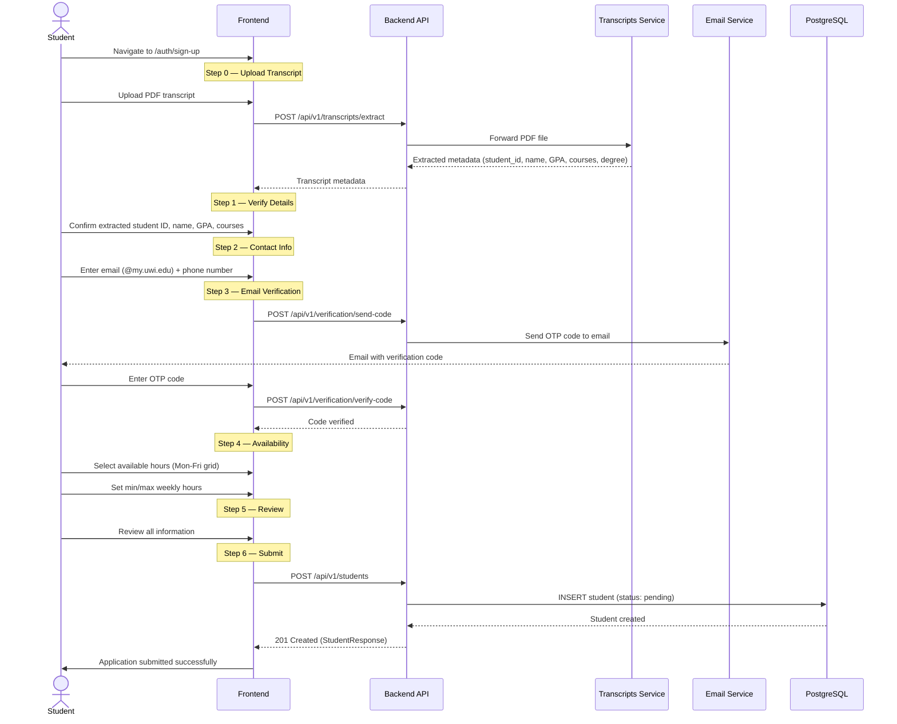
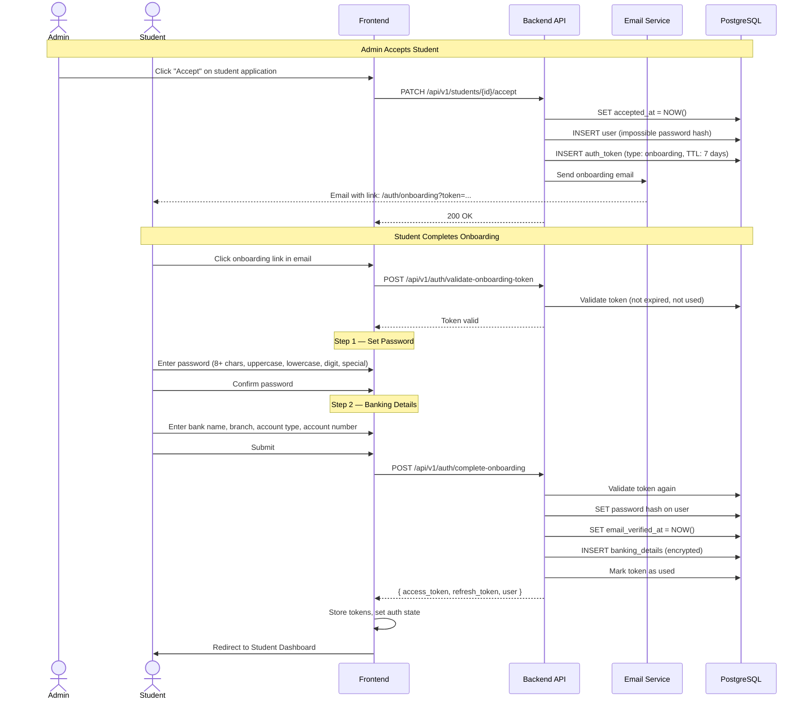
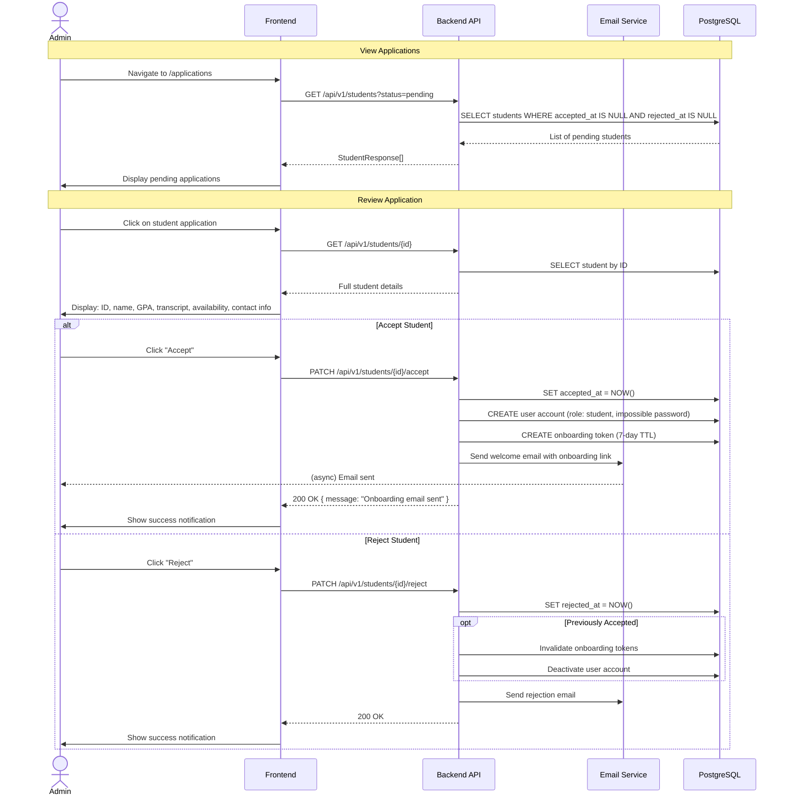
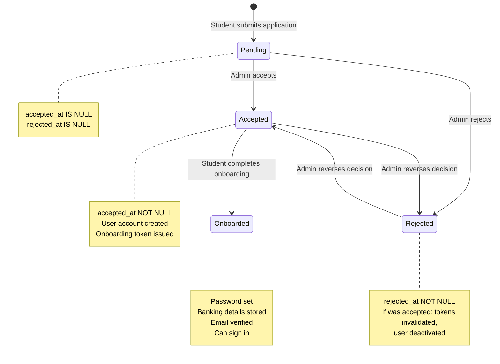
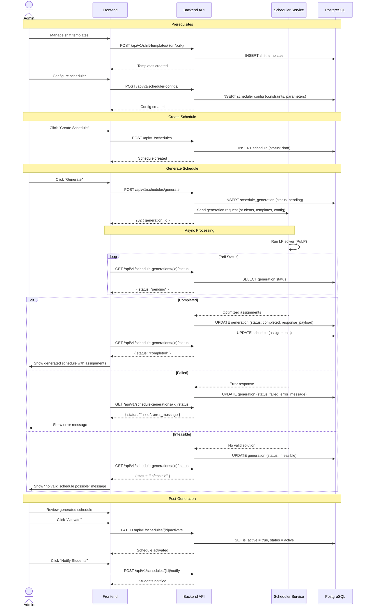
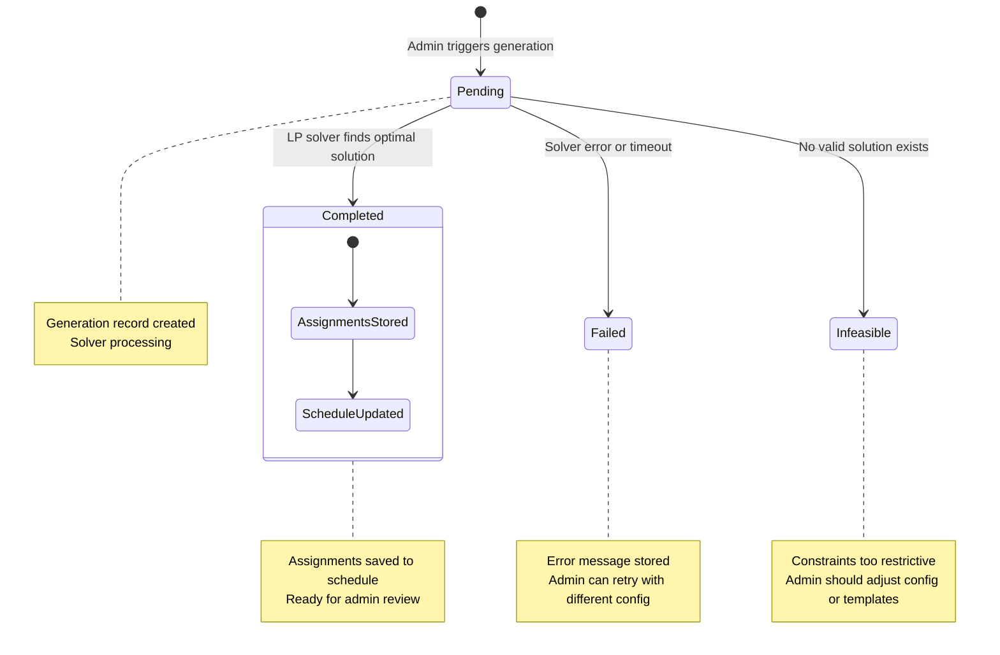
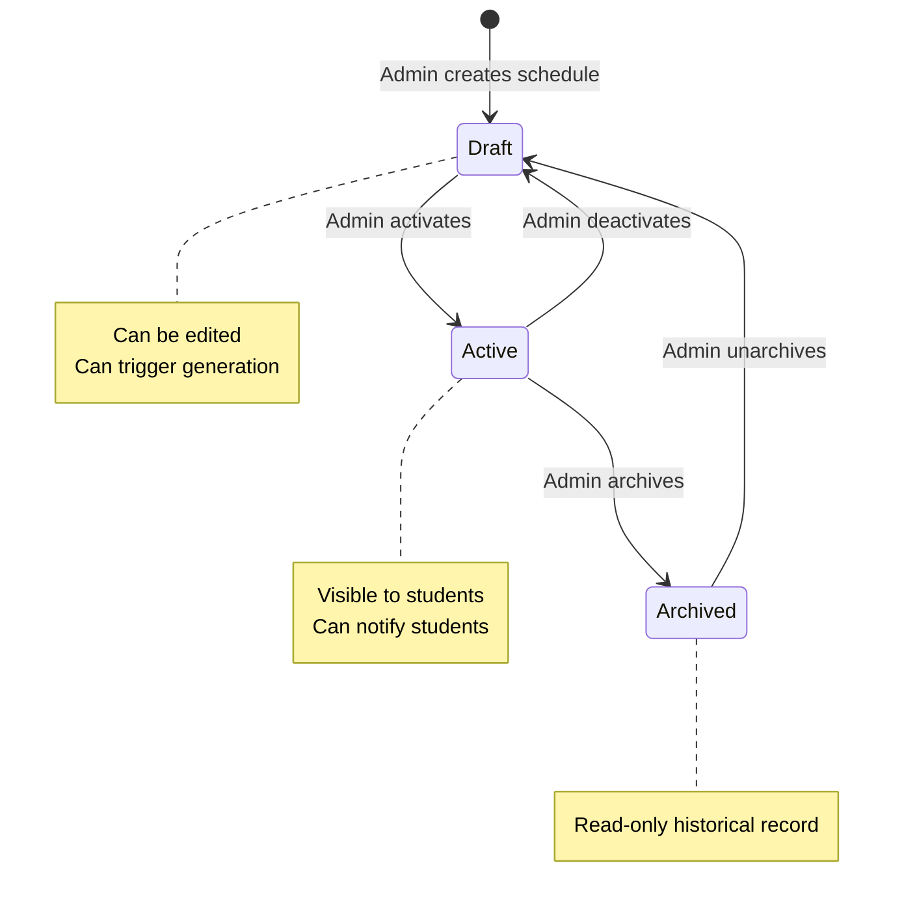
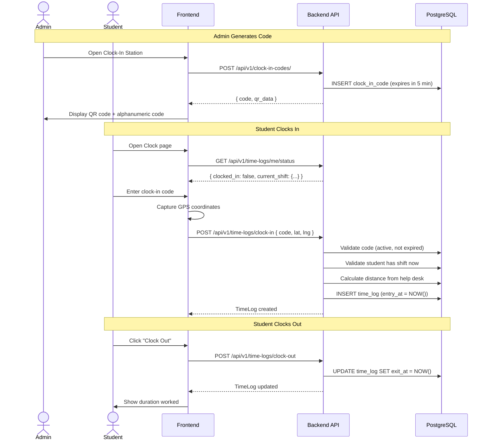
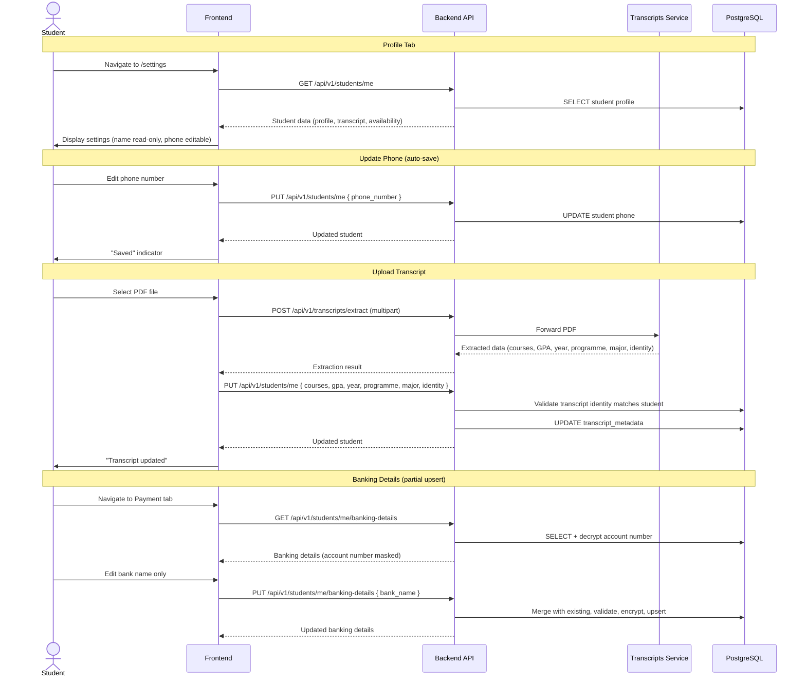
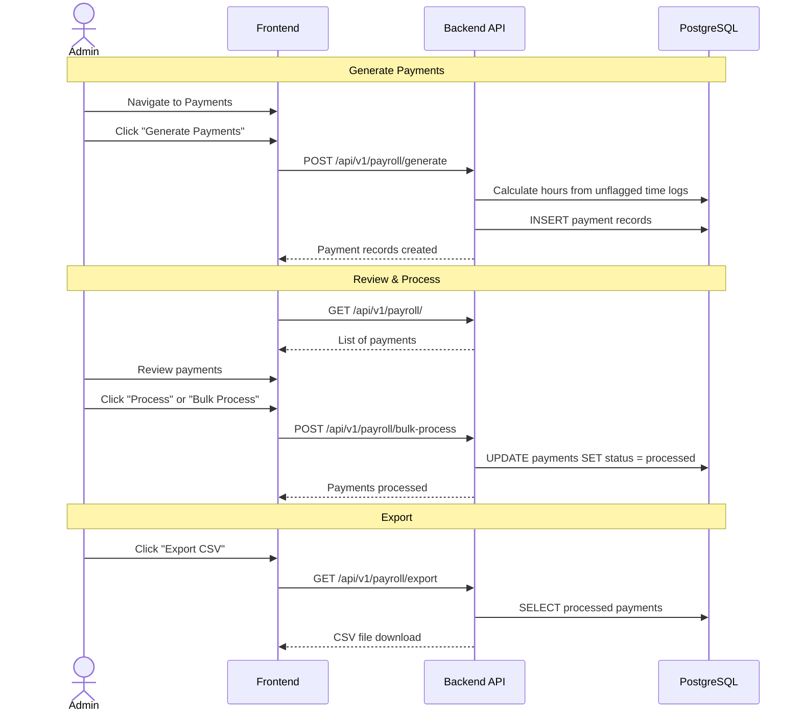

# User Flow Diagrams

## 1. Student Registration Flow

## 2. Student Onboarding Flow

## 3. Admin Student Accept/Reject Flow

### Student Application Lifecycle

## 4. Admin Schedule Generation Flow

### Schedule Generation Lifecycle

### Schedule Lifecycle

## 5. Student Clock-In/Out Flow

## 6. Student Settings Flow

## 7. Admin Payroll Flow

